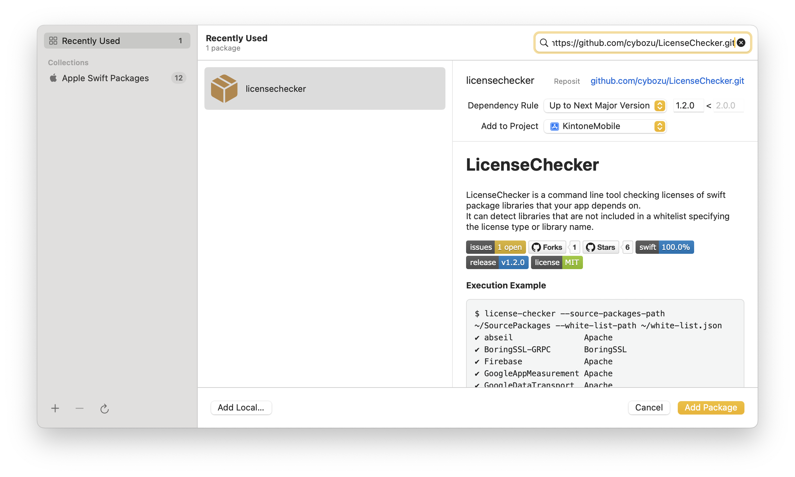
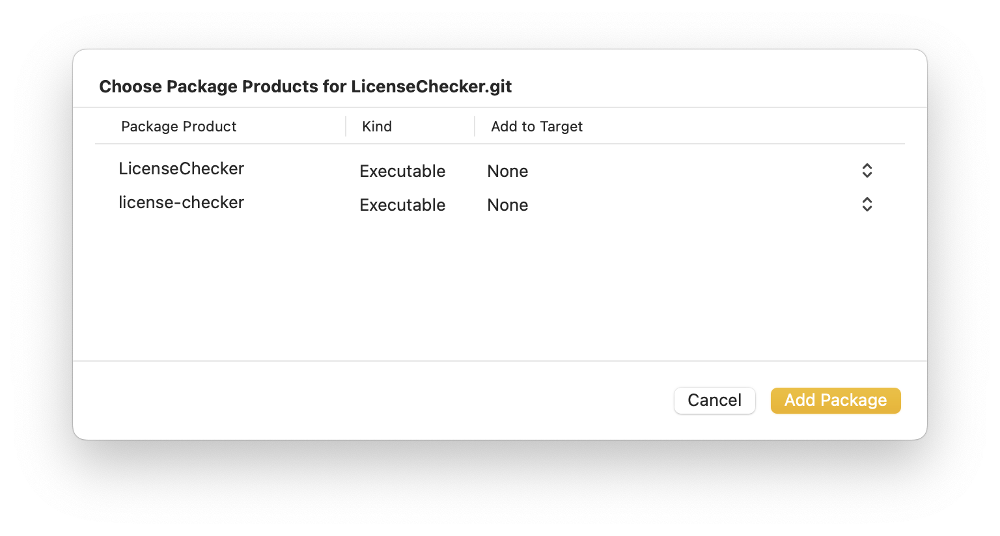
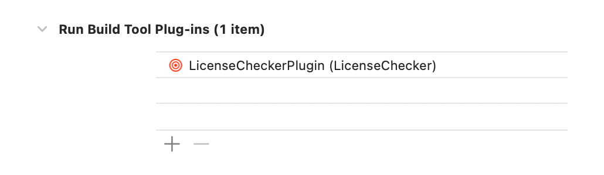

# LicenseChecker

LicenseChecker is a command line tool checking licenses of swift package libraries that your app depends on.  
It can detect libraries that are not included in a whitelist specifying the license type or library name.

[](https://github.com/cybozu/LicenseChecker/network/members)
[](https://github.com/cybozu/LicenseChecker/stargazers)
[](https://github.com/cybozu/LicenseChecker/issues)
[](https://github.com/cybozu/LicenseChecker/release)
[](https://github.com/cybozu/LicenseChecker/blob/main/LICENSE)

**Execution Example**

```shell
$ license-checker --source-packages-path ~/SourcePackages --white-list-path ~/white-list.json
✔︎ abseil               Apache
✔︎ BoringSSL-GRPC       BoringSSL
✔︎ Firebase             Apache
✔︎ GoogleAppMeasurement Apache
✔︎ GoogleDataTransport  Apache
✔︎ GoogleUtilities      MIT
✔︎ gRPC                 Apache
✔︎ GTMSessionFetcher    Apache
✔︎ Kanna                MIT
✔︎ KeychainAccess       MIT
✔︎ Kingfisher           MIT
✔︎ leveldb              BSD
✔︎ LicenseList          MIT
✔︎ nanopb               zlib
✔︎ ObjectMapper         MIT
✔︎ Promises             Apache
✔︎ R.swift.Library      MIT
✔︎ Reachability         MIT
✔︎ RxGesture            MIT
✔︎ RxSwift              MIT
✔︎ SwiftProtobuf        Apache
✅ No problems with library licensing.
$
```

## Requirements

- Development with Xcode 16.2+
- Written in Swift 6.0
- Compatible with macOS 14.0+

## How to Use

0. Prepare a white list (`white-list.json`).

- Specify the type of license to approve.
- Specify the name of library to approve (for private libraries).

LicenseChecker supports the following licenses:

| license type               | white list key |
| :------------------------- | :------------- |
| Apache license 2.0         | `Apache`       |
| MIT License                | `MIT`          |
| BSD 3-clause Clear license | `BSD`          |
| zLib License               | `zlib`         |
| BoringSSL                  | `BoringSSL`    |

**Sample of `white-list.json`**

```json
{
  "licenses": [
    "Apache", 
    "MIT", 
    "BSD",  
    "zlib",
    "BoringSSL"
  ],
  "libraries": [
    "PrivateLibrary-Hoge"
  ]
}
```

### XcodeBuildToolPlugin (for Xcode Project)

1. Put `white-list.json` to the project root.
2. File > Add Package Dependencies…  
   
3. Search `https://github.com/cybozu/LicenseChecker.git.`  
   
4. Use plugin in Build Phases.  
   

### BuildToolPlugin (for Swift Package Project)

1. Put `white-list.json` to the package root.

2. Add the dependency of plugin to `Package.swift`.

   ```swift
   dependencies: [
       .package(url: "https://github.com/cybozu/LicenseChecker.git", exact: "1.2.0")
   ],
   ```

3. Use plugin in the target (`Package.swift`).

   ```swift
   targets: [
       .target(
           name: "SomeFeature",
           plugins: [
               .plugin(name: "LicenseCheckerPlugin", package: "LicenseChecker")
           ]
       )
   ]
   ```

### CommandPlugin & Run Script in BuildPhases (for Xcode Project)

If your project directory structure is special and you want to specify the path to white-list.json, use CommandPlugin.

1. Add binary target & plugin to `Package.swift`.

   ```swift
   targets: [
       .binaryTarget(
           name: "license-checker",
           url: "https://github.com/cybozu/LicenseChecker/releases/download/1.2.0/license-checker-macos.artifactbundle.zip",
           checksum: "4b3aacb1c2b2b91012db0b13680eba82f79a779c7271d086e12028901ada71b5"
       ),
       .plugin(
           name: "LicenseCheckerCommand",
           capability: .command(
               intent: .custom(verb: "license-checker", description: "Run LicenseChecker"),
               permissions: []
           ),
           dependencies: ["license-checker"]
       )
   ]
   ```

2. Code `Plugins/LicenseCheckerCommand/main.swift`.

   ```swift
   import Foundation
   import PackagePlugin

   @main
   struct LicenseCheckerCommand: CommandPlugin {
       func performCommand(context: PluginContext, arguments: [String]) async throws {
           let tool = try context.tool(named: "license-checker")

           let process = try Process.run(tool.url, arguments: arguments)
           process.waitUntilExit()

           guard process.terminationReason == .exit else {
               Diagnostics.error("Termination Other Than Exit")
               return
           }
           guard process.terminationStatus == EXIT_SUCCESS else {
               Diagnostics.error("Command Failed")
               return
           }
       }
   }
   ```

3. Add a Run Script in BuildPhases
   ```shell
   SOURCE_PACKAGES_PATH=`echo ${BUILD_DIR%Build/*}SourcePackages`
   xcrun --sdk macosx swift run --package-path ${SOURCE_PACKAGES_PATH}/checkouts/LicenseChecker --disable-sandbox license-checker -s ${SOURCE_PACKAGES_PATH} -w [Path to white-list.json]
   ```
   
If `white-list.json` can be found in the project, you should use `${SRCROOT}` for the path to it.

## license-checker (command help)

```shell
$ swift run license-checker -h
Building for debugging...
Build complete! (0.10s)
OVERVIEW: A tool to check license of swift package libraries.

USAGE: license-checker --source-packages-path <source-packages-path> --white-list-path <white-list-path> [--verbose] [--quiet] [--tab]

OPTIONS:
  -s, --source-packages-path <source-packages-path>
                          Path to SourcePackages directory
  -w, --white-list-path <white-list-path>
                          Path to white-list.json
  -v, --verbose           Enable verbose output
  -q, --quiet             Only show forbidden licenses
  -t, --tab               Enable tab-separated output
  --version               Show the version.
  -h, --help              Show help information.
```
